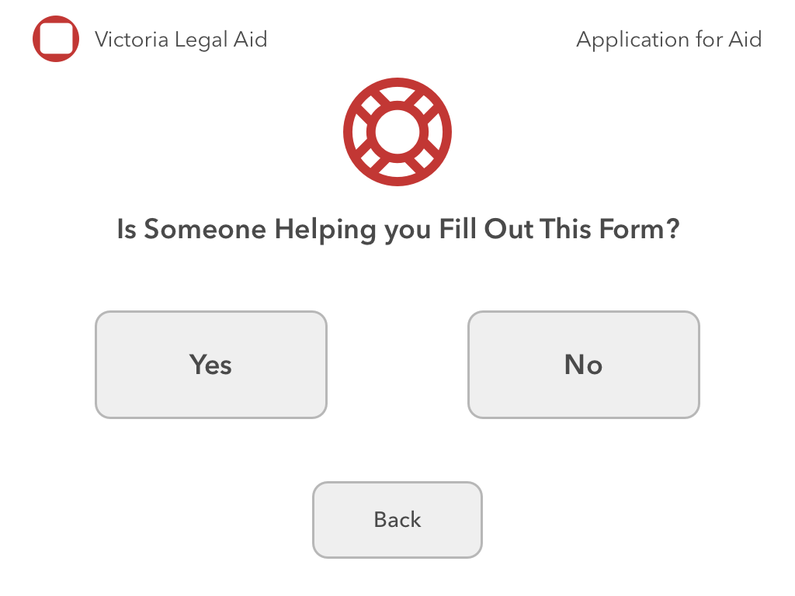
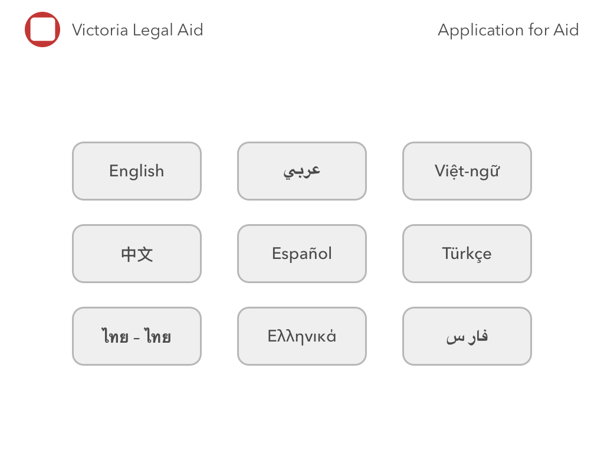
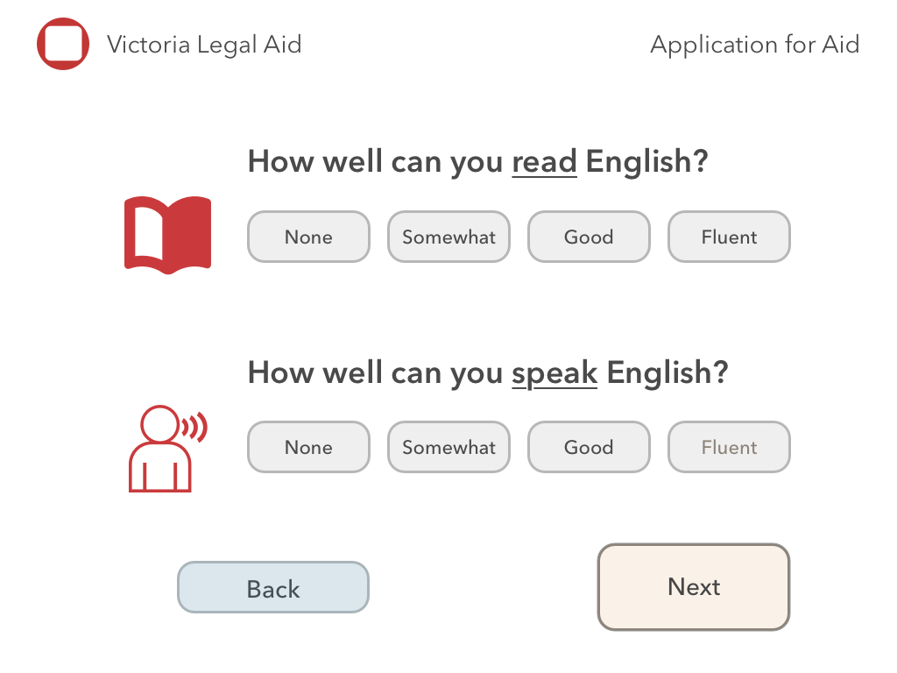
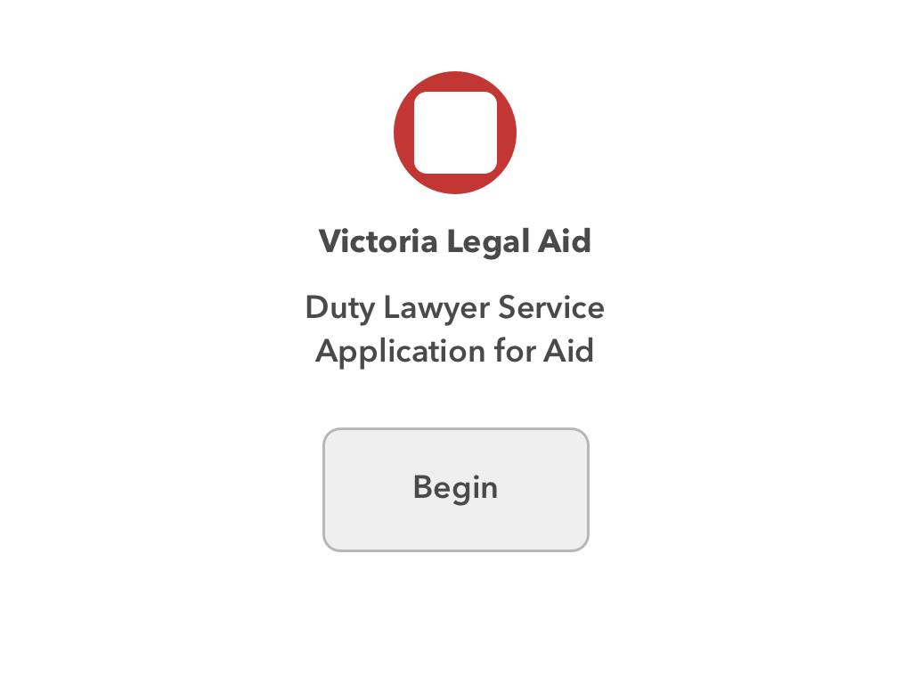

# Artboards

This is an autogenerated file showing all the artboards. Do not edit it directly.

## B_Help

## B_Language

## B_ReadSpeak

## B_Splash

## Back Button

## Button

## sml_Button

## stumpy button

