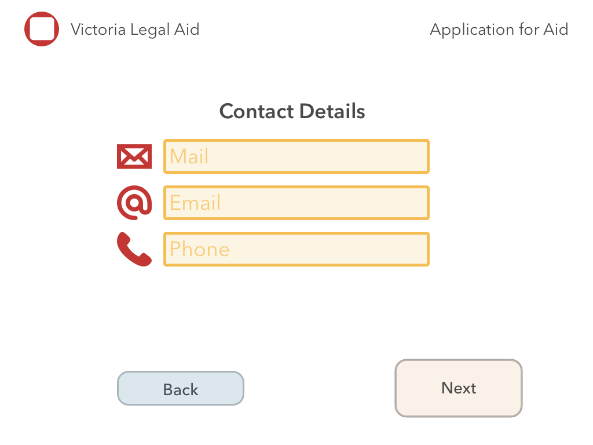
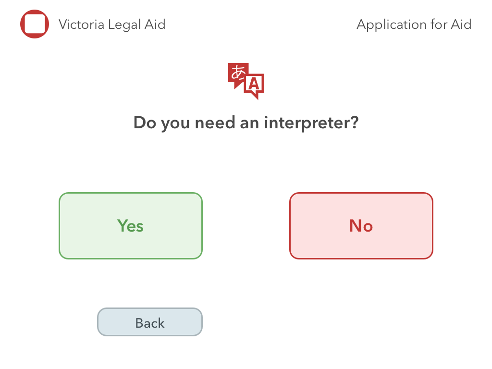
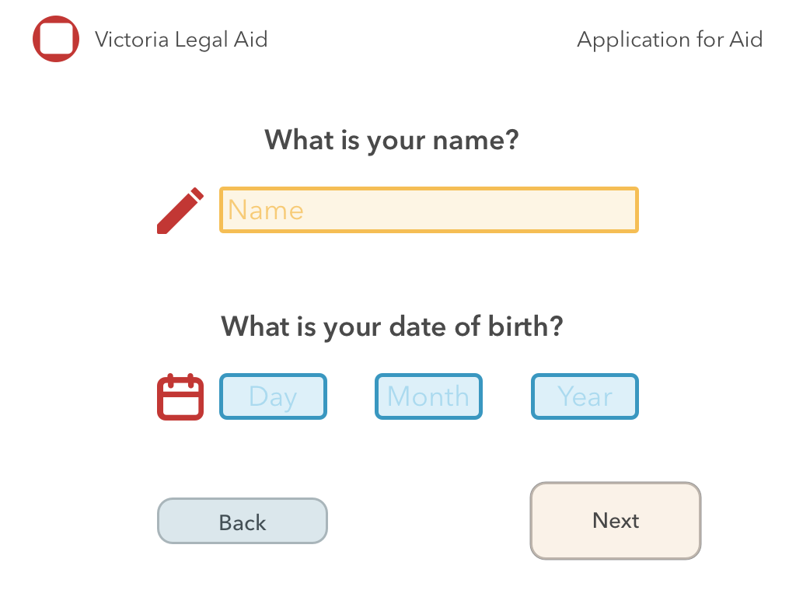
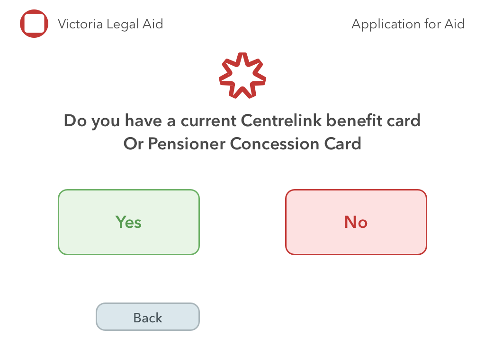
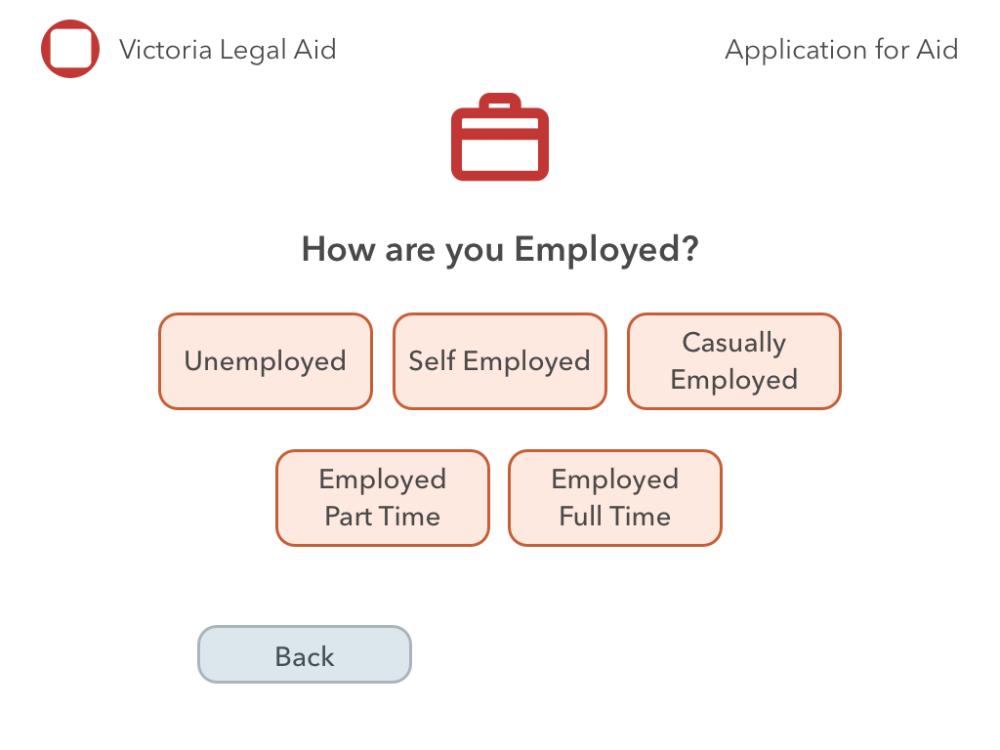

# Artboards

This is an autogenerated file showing all the artboards. Do not edit it directly.

## B_Contact

## B_Help

## B_Interpreter

## B_Language

## B_NDOB

## B_ReadSpeak

## B_Splash

## B_conc

## B_employment

## Back Button

## Button

## Item Entry Small

## Text Entry

## sml_Button

## stumpy button

